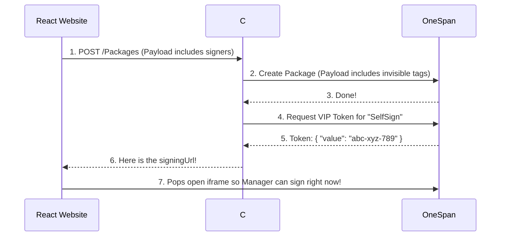

# OneSpan eSignature Service - Plain English Guide

This document explains how our eSignature system works step-by-step in simple terms, while showing exactly what data (JSON) is being passed back and forth at every stage.

## 1. How it Starts (The Frontend Request)
Our React app (the front end) sends a request to our C# server (the back end) saying, *"Hey, I have a document that needs to be signed by these specific people."*

**The Data React Sends to C#:**
```json
{
 "workflowName": "New Hire Contract",
 "signers": [
   {
     "roleId": "SelfSign",
     "firstName": "Jane",
     "lastName": "Doe",
     "email": "manager@example.com",
     "signingOrder": 1
   },
   {
     "roleId": "RemoteSigner",
     "firstName": "John",
     "lastName": "Smith",
     "email": "employee@example.com",
     "signingOrder": 2
   }
 ],
 "documents": "[The physical PDF file attached]"
}
```

**Understanding the Keys in Plain English:**
- **`workflowName`**: The title of the document.
- **`signers`**: The list of people signing.
  - **`signingOrder`**: Who goes first (1), who goes second (2), etc.
  - **`roleId` (The Magic Key)**: We use this to decide *how* they sign. If we tag them as `"SelfSign"`, the system will pop up a window for them to sign right now. If we tag them as `"RemoteSigner"`, the system will email them a link instead.

---

## 2. The Step-by-Step Story

### Step 1: Talking to OneSpan
Our C# server packages up the PDF and the list of signers, and hands it off to OneSpan's servers. We tell OneSpan: *"Find the invisible word 'SelfSign' on the PDF and put a signature box exactly on top of it. Do the same for 'RemoteSigner'."*

**The Data C# Sends to OneSpan:**
```json
{
 "name": "New Hire Contract",
 "status": "SENT",
 "roles": [
   {
     "id": "SelfSign",
     "index": 1,
     "signers": [ { "email": "manager@example.com", "firstName": "Jane", "lastName": "Doe" } ]
   },
   {
     "id": "RemoteSigner",
     "index": 2,
     "signers": [ { "email": "employee@example.com", "firstName": "John", "lastName": "Smith" } ]
   }
 ],
 "documents": [
   {
     "name": "Contract.pdf",
     "extract": true,
     "approvals": [
       {
         "role": "SelfSign",
         "fields": [
           {
             "type": "SIGNATURE",
             "extract": true,
             "extractAnchor": { "text": "SelfSign", "width": 200, "height": 50, "anchorPoint": "TOPLEFT", "topOffset": -25 }
           }
         ]
       }
     ]
   }
 ]
}
```
**Plain English Keys:**
* **`extractAnchor`**: This is where we tell OneSpan to literally scan the PDF for the text `"SelfSign"` and drop a 200x50 box over it.

*OneSpan replies to your C# Server: "Success! I have created the transaction. Here is your Package ID: Pkg-1234."*

---

### Step 2: The VIP Pass (Token Request)
Because our C# server saw that Jane was tagged as `"SelfSign"`, it knows she wants to sign right now on our website. It asks OneSpan for a VIP pass so she doesn't have to wait for an email.

**The Data C# Sends to OneSpan:**
```json
{
  "packageId": "Pkg-1234",
  "signerId": "SelfSign"
}
```
**The Data OneSpan Replies back to C#:**
```json
{
  "value": "abc-xyz-789"
}
```
* **`value`**: The secure, one-time-use code (the "VIP Pass").

---

### Step 3: The Pop-Up (Modal) Trigger
Our C# server builds a special link using that VIP pass, and sends it back to our React website. 

**The Data C# Replies to React:**
```json
{
  "success": true,
  "message": "Signature transaction successfully initialized and sent.",
  "packageId": "Pkg-1234",
  "signingUrl": "https://sandbox.esignlive.com/access?sessionToken=abc-xyz-789"
}
```
Our React website is programmed to look for `signingUrl`. Because this link arrived, the React website instantly opens a pop-up window showing the document so Jane can sign it. 

---

### Step 4: Jane Signs
Jane clicks "Sign" in the pop-up window. Behind the scenes, OneSpan sends a tiny, invisible message to our React website saying, *"Jane is done!"* so our website knows to automatically close the pop-up window.

---

### Step 5: The Domino Effect (Emails)
Because Jane was `signingOrder: 1`, she's done. OneSpan looks at the list and sees John is `signingOrder: 2`. OneSpan automatically shoots John an email saying *"It's your turn to sign."*

Three days later, John clicks his email and signs it. The document is 100% complete!

## 3. Visual Picture



## 4. How to Run Locally

Follow these steps to run the full application (frontend and backend) on your local machine.

### Prerequisites
- [.NET 8.0 SDK](https://dotnet.microsoft.com/download) (or the relevant version installed on your machine)
- [Node.js](https://nodejs.org/) (for the React frontend)
- A OneSpan Sandbox Account (for your API Key)

### Step 1: Configure the Backend
1. Open the `appsettings.json` file in the root directory.
2. Update the `OneSpan` section with your sandbox credentials:
   ```json
   "OneSpan": {
     "ApiKey": "YOUR_ONESPAN_API_KEY",
     "ApiUrl": "https://sandbox.esignlive.com/api"
   }
   ```
   *(Note: You can also use the `.env` file for setting environment variables).*

### Step 2: Start the Backend (.NET Server)
1. Open a terminal in the root directory (`onespan-esignature-service`).
2. Run the following command to start the server:
   ```bash
   dotnet run
   ```
   The backend will start and typically listen on `http://localhost:5000` or `https://localhost:5001`.

### Step 3: Start the Frontend (React Client)
1. Open a new terminal and navigate to the `react-client` folder:
   ```bash
   cd react-client
   ```
2. Install the frontend dependencies:
   ```bash
   npm install
   ```
3. Start the development server:
   ```bash
   npm run dev
   ```
4. The React application will be available at the URL shown in your terminal (usually `http://localhost:5173`).