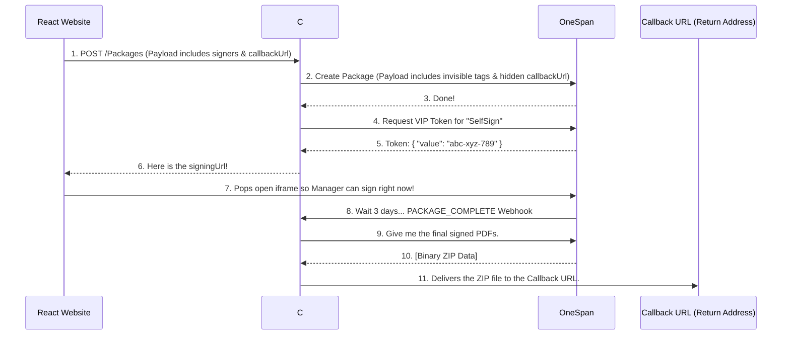

# OneSpan eSignature Service - Plain English Guide

This document explains how our eSignature system works step-by-step in simple terms, while showing exactly what data (JSON) is being passed back and forth at every stage.

## 1. How it Starts (The Frontend Request)
Our React app (the front end) sends a request to our C# server (the back end) saying, *"Hey, I have a document that needs to be signed by these specific people."*

**The Data React Sends to C#:**
```json
{
 "workflowName": "New Hire Contract",
 "callbackUrl": "https://webhook.site/placeholder-url-for-testing",
 "signers": [
   {
     "roleId": "SelfSign",
     "firstName": "Jane",
     "lastName": "Doe",
     "email": "manager@example.com",
     "signingOrder": 1
   },
   {
     "roleId": "RemoteSigner",
     "firstName": "John",
     "lastName": "Smith",
     "email": "employee@example.com",
     "signingOrder": 2
   }
 ],
 "documents": "[The physical PDF file attached]"
}
```

**Understanding the Keys in Plain English:**
- **`workflowName`**: The title of the document.
- **`signers`**: The list of people signing.
  - **`signingOrder`**: Who goes first (1), who goes second (2), etc.
  - **`roleId` (The Magic Key)**: We use this to decide *how* they sign. If we tag them as `"SelfSign"`, the system will pop up a window for them to sign right now. If we tag them as `"RemoteSigner"`, the system will email them a link instead.
- **`callbackUrl` (The Return Address)**: *See the Deep Dive box below!*

> [!TIP]
> **Deep Dive: What exactly is the `callbackUrl`?**
> Think of the `callbackUrl` as a self-addressed stamped envelope. 
> When our C# server sends the document to OneSpan, it sneaks this `callbackUrl` into the package's hidden backpack (called "attributes"). 
> **Why?** Because getting signatures takes days. We don't want our React app to freeze and wait on screen for 3 days. So, the React app says, *"I'm going to close out now, but when John finally signs this 3 days from now, please mail the final `.zip` file of PDFs to this exact URL."* 
> When the signing is finally 100% complete, the C# server will blindly obey and deliver the final files to whatever URL you typed in here, so your backend database can save the finished PDF!

---

## 2. The Step-by-Step Story

### Step 1: Talking to OneSpan
Our C# server packages up the PDF and the list of signers, and hands it off to OneSpan's servers. We tell OneSpan: *"Find the invisible word 'SelfSign' on the PDF and put a signature box exactly on top of it. Do the same for 'RemoteSigner'."*

**The Data C# Sends to OneSpan:**
```json
{
 "name": "New Hire Contract",
 "status": "SENT",
 "roles": [
   {
     "id": "SelfSign",
     "index": 1,
     "signers": [ { "email": "manager@example.com", "firstName": "Jane", "lastName": "Doe" } ]
   },
   {
     "id": "RemoteSigner",
     "index": 2,
     "signers": [ { "email": "employee@example.com", "firstName": "John", "lastName": "Smith" } ]
   }
 ],
 "documents": [
   {
     "name": "Contract.pdf",
     "extract": true,
     "approvals": [
       {
         "role": "SelfSign",
         "fields": [
           {
             "type": "SIGNATURE",
             "extract": true,
             "extractAnchor": { "text": "SelfSign", "width": 200, "height": 50, "anchorPoint": "TOPLEFT", "topOffset": -25 }
           }
         ]
       }
     ]
   }
 ],
 "attributes": { "CallbackUrl": "https://webhook.site/placeholder-url-for-testing" }
}
```
**Plain English Keys:**
* **`extractAnchor`**: This is where we tell OneSpan to literally scan the PDF for the text `"SelfSign"` and drop a 200x50 box over it.
* **`attributes`**: This is the hidden backpack where we hide the `callbackUrl` for later!

*OneSpan replies to your C# Server: "Success! I have created the transaction. Here is your Package ID: Pkg-1234."*

---

### Step 2: The VIP Pass (Token Request)
Because our C# server saw that Jane was tagged as `"SelfSign"`, it knows she wants to sign right now on our website. It asks OneSpan for a VIP pass so she doesn't have to wait for an email.

**The Data C# Sends to OneSpan:**
```json
{
  "packageId": "Pkg-1234",
  "signerId": "SelfSign"
}
```
**The Data OneSpan Replies back to C#:**
```json
{
  "value": "abc-xyz-789"
}
```
* **`value`**: The secure, one-time-use code (the "VIP Pass").

---

### Step 3: The Pop-Up (Modal) Trigger
Our C# server builds a special link using that VIP pass, and sends it back to our React website. 

**The Data C# Replies to React:**
```json
{
  "success": true,
  "message": "Signature transaction successfully initialized and sent.",
  "packageId": "Pkg-1234",
  "signingUrl": "https://sandbox.esignlive.com/access?sessionToken=abc-xyz-789"
}
```
Our React website is programmed to look for `signingUrl`. Because this link arrived, the React website instantly opens a pop-up window showing the document so Jane can sign it. 

---

### Step 4: Jane Signs
Jane clicks "Sign" in the pop-up window. Behind the scenes, OneSpan sends a tiny, invisible message to our React website saying, *"Jane is done!"* so our website knows to automatically close the pop-up window.

---

### Step 5: The Domino Effect (Emails & Webhook)
Because Jane was `signingOrder: 1`, she's done. OneSpan looks at the list and sees John is `signingOrder: 2`. OneSpan automatically shoots John an email saying *"It's your turn to sign."*

Three days later, John clicks his email and signs it. The document is 100% complete! OneSpan immediately yells out to our C# server (via a "webhook"): *"HEY! The package is completely finished!"*

**The Webhook Data OneSpan sends to C#:**
```json
{
  "@class": "com.silanis.esl.packages.event.ESLProcessEvent",
  "name": "PACKAGE_COMPLETE",
  "sessionUser": "0787be84-...",
  "packageId": "Pkg-1234",
  "message": null,
  "documentId": null
}
```
**Plain English Keys:**
* **`name`**: The specific event that happened (`"PACKAGE_COMPLETE"` means everyone is finally done).
* **`packageId`**: The ID of the transaction. The C# server uses this to go fetch the final `.zip` file from OneSpan.

---

### Step 6: The Final Delivery
Our C# server hears the webhook, runs over to OneSpan, downloads the final, legally-signed PDF as a `.zip` file, and looks in the hidden backpack for the `CallbackUrl`. It delivers the ZIP file straight to that URL!

**The Final Data C# sends to the Callback URL:**
```http
POST https://webhook.site/placeholder-url-for-testing
Content-Type: multipart/form-data; boundary=---Boundary123

-----Boundary123
Content-Disposition: form-data; name="document"; filename="signed_package_Pkg-1234.zip"
Content-Type: application/zip

[BINARY ZIP FILE DATA]
-----Boundary123--
```

## 3. Visual Picture


